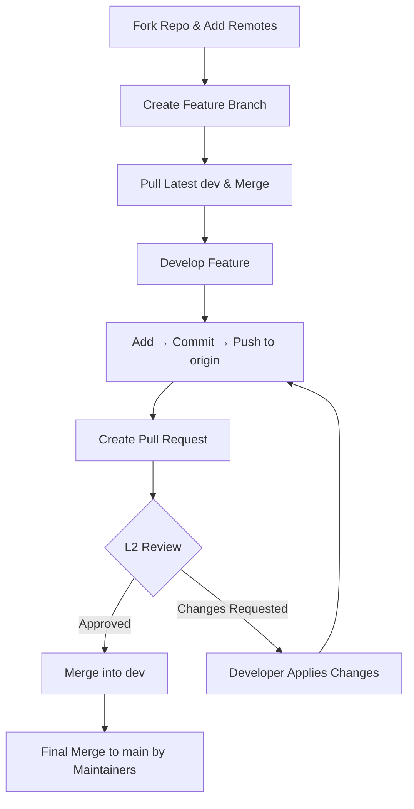

# GitHub Contribution Standards – Organisation Guide

This README defines the **official workflow** for contributors in our organisation.  
Follow these guidelines strictly to maintain clean collaboration, structured development, and high-quality code.

---

# 🚀 1. Fork the Repository

Every contributor must work on **their own fork**.

- Open the organisation repo  
- Click **Fork**

> You will never push code directly to the organisation repository.

---

# 🧩 2. Add Remotes (No Cloning)

You already have the project folder.  
Now connect it to GitHub.

## 🪟 Windows (HTTPS)

### Add your fork as origin:
```bash
git remote add origin https://github.com/<your-username>/<repo>.git
```
**Meaning:** Connects local repo → your GitHub fork.

### Add organisation repo as upstream:
```bash
git remote add upstream https://github.com/<org>/<repo>.git
```
**Meaning:** Allows pulling the latest official code.

---

## 🐧 Linux / macOS (SSH)

### Generate SSH key:
```bash
ssh-keygen -t ed25519 -C "your-email@example.com"
```
**Meaning:** Creates secure credentials for GitHub.

### Add your fork as origin:
```bash
git remote add origin git@github.com:<your-username>/<repo>.git
```
### Add organisation repo as upstream:
```bash
git remote add upstream git@github.com:<org>/<repo>.git
```

### Check remotes:
```bash
git remote -v
```
**Meaning:** Shows origin & upstream mapping.

---

# 🌿 3. Branching Standards

Every task = new feature branch.

```bash
git checkout -b feature/<branch-name>
```

**Meaning:** Creates and switches into a new branch.

Examples:
- `feature/login-page`
- `feature/payment-flow`
- `bugfix/navbar-error`

> Never work directly on `main` or `dev`.
```
dev branch →

All active development happens here; developers merge their feature branches into dev before preparing a release.

main branch →

Stable release branch; merging into main triggers tag creation, staging deployment, and the automated production release workflow.
```
---

# 🔄 4. Sync Code Before You Start Working

* Directly from the `cli`

```bash
git checkout dev
git pull upstream dev
git checkout feature/<branch>
git merge dev
```

* Or else you can directly sync your code from 

### What each command does:
- **git checkout dev** → Switch to dev branch
- **git pull upstream dev** → Get latest organisation updates
- **git checkout feature/...** → Go back to your branch
- **git merge dev** → Bring latest dev into your branch

---

# 💾 5. Add → Commit → Push

### Stage changes:
```bash
git add .
```
**Meaning:** Selects all modified files to be committed.

### Commit changes:
```bash
git commit -m "feat: added user roles"
```
**Meaning:** Saves your update with a message.

### Push to your fork:
```bash
git push origin feature/<branch>
```
**Meaning:** Uploads your work to GitHub.

---

# 🔁 6. Sync Before Creating PR

```bash
git checkout dev
git pull upstream dev
git checkout feature/<branch>
git merge dev
```
**Meaning:** Ensures your PR is conflict-free.

---

# 🔀 7. Create Pull Request

In GitHub:

- Base: **dev**
- Compare: **feature/<branch>**
- Add description (what/why/how)

Submit PR.

---

# 🧑‍🏫 8. Review Cycle (Circular Workflow)

There are **two outcomes**:

---

## ✅ Case 1: PR Approved  
L2 Developer merges your work → `dev`.

---

## ❌ Case 2: Changes Requested  
You must update your branch:

```bash
git add .
git commit -m "fix: updated logic as requested"
git push
```

PR auto-updates and returns to review.

---

# 🔁 Circular Review Flow (Mermaid)



---

# 🏁 9. Final Merge to Production (`main`)

Only maintainers merge:
```
dev → main
```

Contributors **never** push to main.

---

# ✔️ 10. Full Workflow Summary

```
Fork →
Add remotes →
Create feature branch →
Pull & merge latest dev →
Develop →
Add/Commit/Push →
Create PR →
Review cycle (Accept OR Request changes) →
Merge to dev →
Maintainers release to main
```

---

# 📄 End of Document
This is the official GitHub workflow for all organisation contributors.

